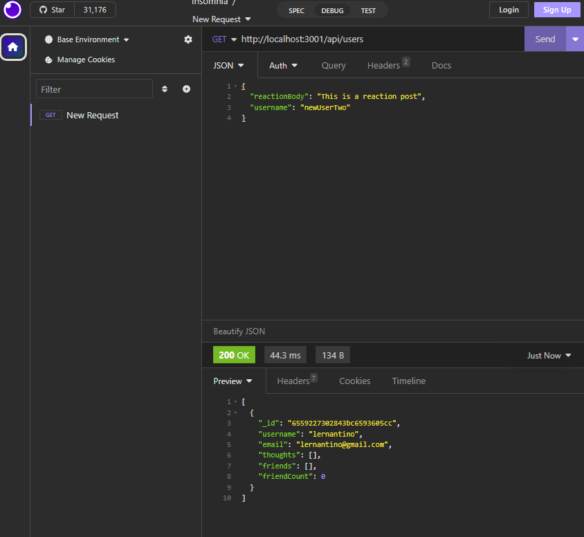

# Nonbiri Network
  ## Table of Contents
- [Description](#description)
- [Installation](#installation)
- [Usage](#usage)
- [License](#license)
- [Contributing](#contributing)
- [Tests](#tests)
- [Questions](#questions)

## Description 
Nonbiri Network is a NoSQL Network API using Mongoose DB. Motivation for the project came from the desire to understand how social networks handle HTTP requests. Nonbiri Network was created to learn a NoSQL database and to get more familiar with unstructured data. If you wanted to give users the ability to interact with other users and share thoughts and reactions you can do so with this app. Things learned from the project include making more dynamic routing for CRUD operations, as well as creating schemas and models, to create the blueprints for our Mongoose collections. Mongoose subdocuments were also learned to organize our database.

## Installation
Make sure you have the node modules in your local machine using the line **npm install**. Also make sure to have a local connection to MongooseDB.

## Usage
Usage Image:

Run the line **node index.js**  or **npm start** to start the app and start making requests. Refer to the demo video for more information on how to make different requests in Insomnia.

Link to Demo Video: https://drive.google.com/file/d/1lFY_DpXan6zIT6fjo7m2vCdjFKPtKwGX/view?usp=sharing

## License
License: MIT

## Contributing 
Go to the Questions section for more info.

## Tests 
No tests at this time.

## Questions 
If you have questions regarding the app, you can reach out to my github or email.

GitHub: https://github.com/Kanabaki

Email: kagomekanabaki@gmail.com

## Notes
Troubleshooting of the userController and userRoutes, and the creation of the createThought and delete thought routes, were developed under Carlin Shaw. Post and Delete Reaction routes were fixed under Learning Assistant Drew in thoughtRoutes.js.